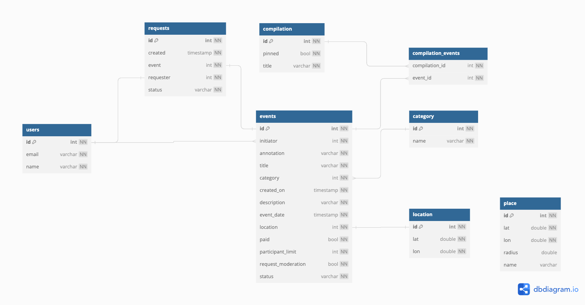

# java-explore-with-me

Ссылка на pull-request: https://github.com/Vlad-Sharapov/java-explore-with-me/pull/6

## Описание проекта

Данный проект представляет собой учебный дипломный проект на языке Java. Он состоит из двух микросервисов: Сервис
статистики и Основной сервис.
Проект разработан в рамках курса Яндекс.Практикума "Java-разработчик".

## Используемые технологии

- Java
- Spring Boot
- Spring Data JPA
- Hybernate
- PostgreSQL
- Maven
- Docker

## Основной сервис

Основной сервис содержит все необходимое для работы приложения.
Он позволяет пользователям просматривать афишу мероприятий, добавлять свои события, а админам контролировать публикацию
событий и создавать подборки

### Функциональность основного сервиса:

- Для пользователей
  - Добавление, редактирование и просмотр своих событий
  - Разделение событий по категориям
  - Предоставление локации, в которой будет проходить событие
  - Просмотр подборок с фильтрацией
  - Получение заявок на участие, одобрение или отклонение заявки инициатором события
  - Возможность ограничить количество заявок на событие
- Для админов
  - Добавление новых пользователей
  - Просмотр всех событий с возможностью фильтрации
  - Редактирование событий
  - Публикация либо отклонение событий
  - Добавление категорий
  - Добавление локаций
  - Создание подборок событий

## Сервис статистики

Сервис статистики собирает информацию. Во-первых, о количестве обращений пользователей к спискам событий и, во-вторых,
о количестве запросов к подробной информации о событии.
На основе этой информации формируется статистика о работе приложения.
Он помогает анализировать популярность мероприятий и определять, какие события наиболее интересны пользователям.

### Функциональность сервиса статистики:

- Хранение
- Возможность получать выборки по событиям для анализа работы приложения

Для приложения настроен Docker, что позволяет легко развернуть его на различных средах без необходимости ручной
настройки зависимостей и переменных среды.

## Спецификации API на Swagger:

- спецификация основного
  сервиса: [ewm-main-service-spec.json](https://raw.githubusercontent.com/yandex-praktikum/java-explore-with-me/main/ewm-main-service-spec.json)
  ;
- спецификация сервиса
  статистики: [ewm-stats-service-spec.json](https://raw.githubusercontent.com/yandex-praktikum/java-explore-with-me/main/ewm-stats-service-spec.json)

## Схема базв данных основного сервиса

